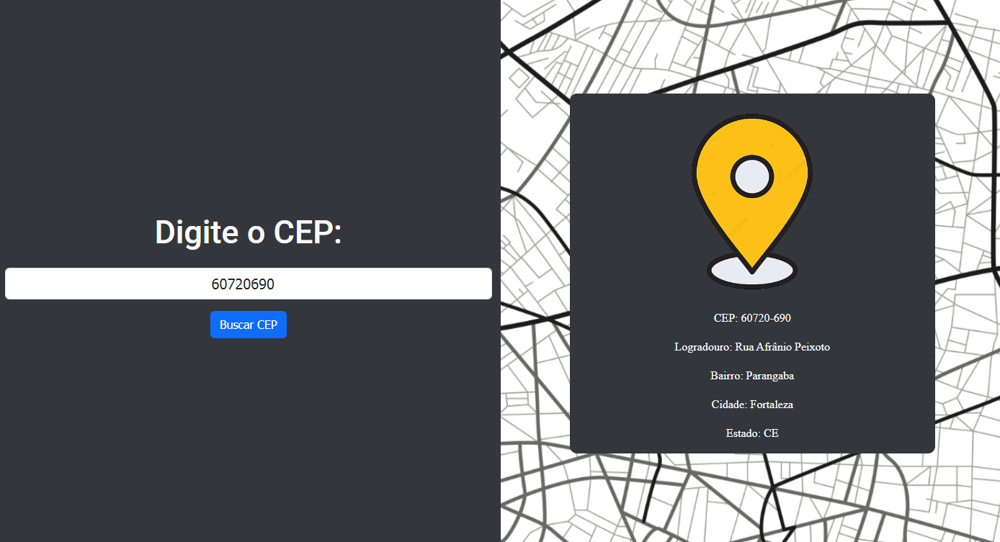

# Consult-ZIP-CODE
📍 Project designed to check your ZIP code by API consumption.

I've developed a project that allows you to easily check your ZIP code and get the corresponding address as a result. This system uses a free API, accessing the services provided by ViaCEP (https://viacep.com.br). The interface was built using the latest web technologies, combining HTML for the structure, CSS with the power of Bootstrap for responsive design, and Javascript for dynamic interactivity. This application provides an intuitive and efficient experience for locating precise information with just the postal code, giving users practicality and agility.

## How to use:
To use the system, simply enter your ZIP code, without dots or dashes, in the search box. If the ZIP code is found, the address data will be displayed on the screen, providing a quick and clear view. In cases where the ZIP code is not found, an informative message will be displayed indicating that the ZIP code entered has not been found. This application provides an intuitive and efficient experience for locating precise information with just the postal code, providing users with practicality and agility.

## Layout

## License 📚
[MIT license](LICENSE).

Made by [Rychard Barros](https://github.com/rychardbarros)
